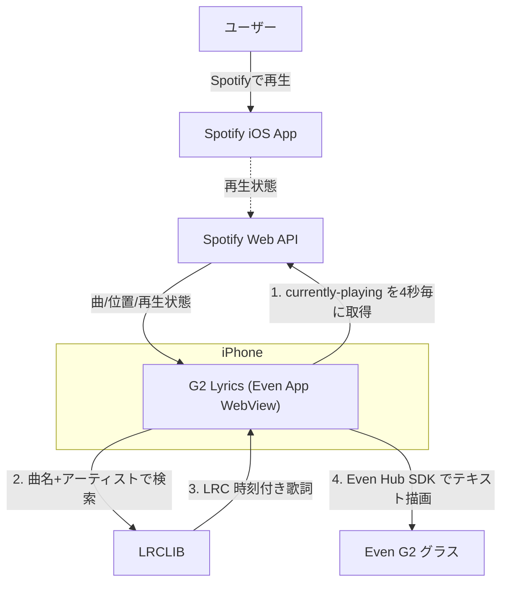

# G2 Lyrics

iPhoneで再生中のSpotifyトラックに合わせて、同期歌詞をEven G2へリアルタイム表示する個人用プロトタイプです。サーバーを持たず、Even AppのWebView内だけで完結します。

> 個人利用・非公開前提のプロトタイプです。公開前にSpotify Developer Policyと歌詞提供元の利用条件を確認してください。

## デモ

<!-- TODO: G2に歌詞が流れる様子のGIF/動画をここに貼る -->
<!--  -->

## 概要

「いま流れている曲」をSpotify Web APIで検知し、曲名・アーティストで歌詞データベース（LRCLIB）から**時刻付き歌詞（LRC）**を取得。再生位置に合わせて前・現在・次の行をG2に表示します。

- 曲情報・再生位置 → **Spotify Web API**（公式）
- 時刻付き歌詞 → **LRCLIB**（コミュニティ運営の無料歌詞DB）
- グラスへの描画 → **Even Hub SDK**（Even App WebView内でのみ動作）

## アーキテクチャ



### データフロー

1. **取得**: `GET /v1/me/player/currently-playing` を4秒ごとにポーリング（曲ID・`progress_ms`・`is_playing`）
2. **検索**: 曲が変わったら曲名・アーティストで歌詞を検索（厳密一致 `/api/get` → フォールバック `/api/search`）
3. **同期**: LRCをパースし、推定再生位置に対して二分探索で表示行を特定
4. **描画**: 前・現在・次の行を Even Hub SDK でG2へ送信（200msごとに更新）

### 再生位置のなめらか同期

APIは4秒に1回しか叩かないが、表示は200msごとに更新したい。そこで「取得値＋経過時間」で現在位置を推定する:

```
現在位置 = progress_ms + (now - サンプル時刻) + 手動補正   // 再生中のみ経過時間を加算
```

APIで定期的に答え合わせしつつ、その間は時計のように自前で進めることで、通信を抑えながら歌詞を滑らかに送る（`src/main.ts` `estimatedPosition`）。

## 技術的チャレンジと解決

このプロジェクトの要点は、Even AppのWebViewという制約環境で外部認証と実機描画を両立させたこと。

| 課題 | 原因 | 解決 |
| --- | --- | --- |
| グラスAPIが常に `invalid(1)` を返す | ネイティブAPIは**Even App WebView内でのみ**動作。素のChromeではbridgeは解決するが呼び出しは全て無効 | Even Appにサイドロード／プラグイン登録して実行する前提に切り替え |
| Spotifyログインが無反応 | Even AppのWebViewが**OAuthのフルページリダイレクトをブロック** | Safariで認証し `clientId~refreshToken` の**接続キー**を発行→アプリに貼る方式。以降はリフレッシュトークンで自動接続 |
| 歌詞がなめらかに進まない | 4秒ポーリングでは粗い | **経過時間ベースの位置推定**＋200ms描画で補間 |
| 歌詞のヒット率が低い | 厳密一致だけでは取りこぼす | `/api/get` 失敗時に `/api/search` へフォールバックし、同期歌詞あり・長さが近い候補を選択 |
| 通信断で表示が消える | 例外で状態を破棄していた | ネットワークエラー時は直近の再生・歌詞を保持し、位置推定でスクロール継続 |

## 主な機能

- Spotify再生中の曲・位置・再生状態を取得（4秒ごと再同期、表示は200msごと更新）
- LRCLIBから時刻付き歌詞を取得（厳密一致→緩い検索のフォールバック）
- G2に前・現在・次の歌詞を表示
- タッチパッドの上下スワイプ／画面ボタンでタイミングを±0.5秒補正
- シングルタップで即時再同期、ダブルタップで終了

## 技術スタック

- TypeScript + Vite（フロントのみ、サーバーレス）
- `@evenrealities/even_hub_sdk`（G2描画・イベント）
- Spotify Web API（PKCE OAuth、クライアントシークレット不要）
- LRCLIB API（認証不要）
- GitHub Actions → GitHub Pages（Safari認証用の配信）

## 必要なもの

- Even G2 と Even App
- Spotify Premiumアカウント
- Spotify Developer DashboardのClient ID
- Node.js 20以上

## セットアップ

### Spotify設定

1. [Spotify Developer Dashboard](https://developer.spotify.com/dashboard)でアプリを作成。
2. G2 LyricsをHTTPSで開き、表示されたRedirect URIをコピー。公開版は `https://yamada0914.github.io/G2-Lyrics/`。
3. SpotifyのSettingsで、そのURLをRedirect URIとして完全一致で登録。
4. Client IDを入力し「Spotifyに接続」。

SpotifyのDevelopment Modeでは利用者をDashboardのUsers Managementへ登録します（上限5人）。

### Redirect URIについて

Spotifyはループバック以外の通常HTTP Redirect URIを受け付けません。LAN IPの `http://192.168.x.x:5173` はiPhone実機の認証に使えないため、GitHub PagesなどへHTTPS配信したURLを使います。

## 開発

```bash
npm install
npm run dev
npm run build
```

ブラウザのみの確認では `http://127.0.0.1:5173/` をSpotify Dashboardに登録できます。

## 配布（Even Hubプラグイン）

Even Appのアプリ一覧／グラスメニューから起動できるよう、プラグインとして登録できます。

```bash
npm run build
evenhub pack app.json dist -o g2lyrics.ehpk
```

生成した `.ehpk` を [Even Hub 開発者ポータル](https://evenhub.evenrealities.com) にアップロードし、ビルドを **Beta** にして Testing group に自分を追加。iPhoneで招待QRを読むとEven Appにインストールされ、以降はメニューからタップ起動できます（URL入力・QRサイドロード不要）。

- `app.json` はパッケージのマニフェスト（`package_id`・権限のホワイトリスト等）
- `vite.config.ts` の `base` は `.ehpk`／Pages両対応のため相対 `./`

## 使い方

1. Even Appで G2 Lyrics を起動（初回はSafariで作った接続キーを貼付、以降は自動接続）
2. iPhoneのSpotifyで曲を再生 → G2に歌詞が表示
3. ズレたらタッチパッドの上下スワイプ／画面ボタンで±0.5秒補正、タップで再同期、ダブルタップで終了

## データと制限

- 曲情報・再生位置はSpotify Web APIから取得。
- 歌詞はコミュニティ運営のLRCLIBから取得。曲によって同期歌詞が存在しない場合があります。
- Spotifyアクセストークンは端末内ストレージに保存されます。
- Refresh Tokenは約180日で再認証が必要になる場合があります。

本実装は公開API仕様を基に独立して作成しています。他のG2歌詞アプリのソースコードは再利用していません。
